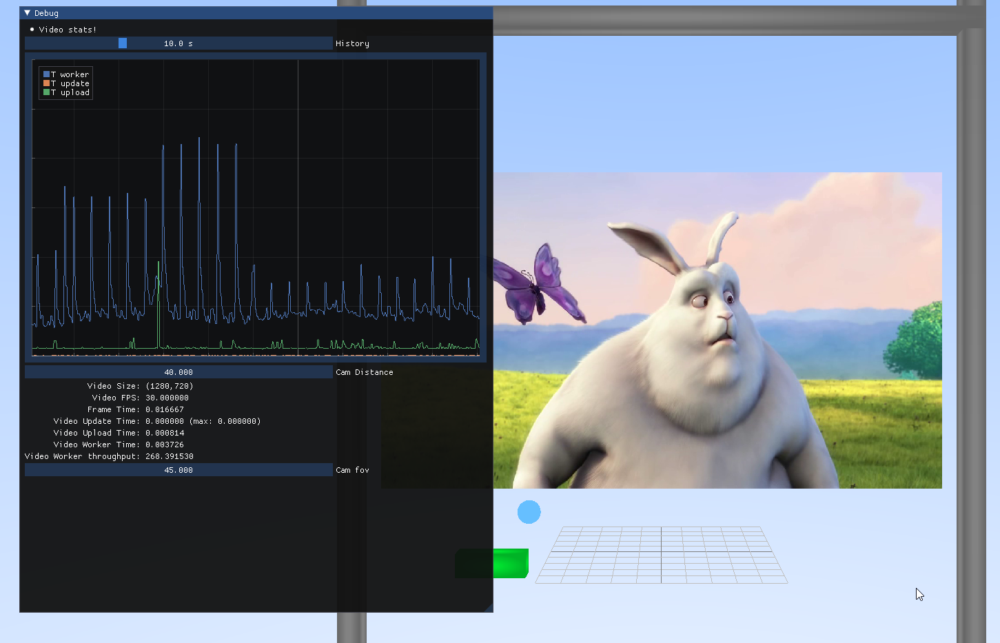

# raylib-video
A multithreaded and streaming capable pl_mpeg wrapper for Raylib.
Plays MPEG1 videofiles.



# License
MIT-License

Contains code from https://github.com/mattiasgustavsson/libs/blob/main/thread.h by Mattias Gustavsson (also MIT).

# Info
Needs pl_mpeg (https://github.com/phoboslab/pl_mpeg) to be in the include path.

# How to use
Check out the header in raylibvideo.h or look into the examples folder.

run
```
git submodule update --init
```

Then build 

## For Windows 
- double click "examples/download_video_example.bat" then
- double click "examples/build.bat".

## For MinGW
- run "examples/download_video_example.sh" then
- run "examples/build.sh".

# API
```c
ray_video_t ray_video_open(const char * path);
ray_video_t ray_video_open_file_handle(FILE * file);
int ray_video_update(ray_video_t *, double deltatime_s);
void ray_video_destroy(ray_video_t *);
```

- Check with ray_video.ok if the video was correctly loaded
- Update the video with ray_video_update
- Get the new frame over ray_video.texture
- Destroy the object at the end with ray_video_destroy

# TODO
- Add seeking API
- Add interface to get the state of the current video
- Add buffering so video frames are getting pre-cached
- Add option to drop frames to stay in sync with video timing on slow rendering
- Add audio support (?)
